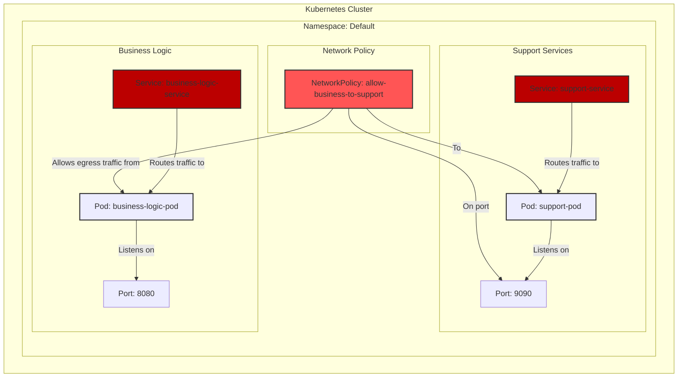

# Вводная
Пример YAML-конфигурации для Kubernetes Service, который включает в себя Pod'ы с бизнес-логикой и обслуживающие 
Pod'ы, а также настраивает сетевую связность.

```yaml
apiVersion: v1
kind: Service
metadata:
  name: business-logic-service  # Имя сервиса
  namespace: default  # Пространство имен, в котором будет развернут сервис
  labels:
    app: business-logic  # Метка для идентификации сервиса
spec:
  selector:
    app: business-logic  # Селектор для выбора Pod'ов, которые будут частью этого сервиса
  ports:
    - name: http
      protocol: TCP
      port: 80  # Порт, на котором сервис будет доступен внутри кластера
      targetPort: 8080  # Порт, на который будут перенаправляться запросы в Pod'ы
  type: ClusterIP  # Тип сервиса. ClusterIP делает сервис доступным только внутри кластера

---
apiVersion: v1
kind: Pod
metadata:
  name: business-logic-pod  # Имя Pod'а с бизнес-логикой
  namespace: default
  labels:
    app: business-logic  # Метка, которая связывает этот Pod с сервисом
spec:
  containers:
    - name: business-logic-container
      image: your-business-logic-image:latest  # Образ контейнера с бизнес-логикой
      ports:
        - containerPort: 8080  # Порт, который контейнер слушает внутри Pod'а

---
apiVersion: v1
kind: Pod
metadata:
  name: support-pod  # Имя обслуживающего Pod'а
  namespace: default
  labels:
    app: support  # Метка для идентификации обслуживающего Pod'а
spec:
  containers:
    - name: support-container
      image: your-support-image:latest  # Образ контейнера с обслуживающей логикой
      ports:
        - containerPort: 9090  # Порт, который контейнер слушает внутри Pod'а

---
apiVersion: v1
kind: Service
metadata:
  name: support-service  # Имя сервиса для обслуживающих Pod'ов
  namespace: default
  labels:
    app: support  # Метка для идентификации сервиса
spec:
  selector:
    app: support  # Селектор для выбора обслуживающих Pod'ов
  ports:
    - name: http
      protocol: TCP
      port: 80  # Порт, на котором сервис будет доступен внутри кластера
      targetPort: 9090  # Порт, на который будут перенаправляться запросы в обслуживающие Pod'ы
  type: ClusterIP  # Тип сервиса. ClusterIP делает сервис доступным только внутри кластера

---
apiVersion: networking.k8s.io/v1
kind: NetworkPolicy
metadata:
  name: allow-business-to-support  # Имя сетевой политики
  namespace: default
spec:
  podSelector:
    matchLabels:
      app: business-logic  # Применяем политику к Pod'ам с бизнес-логикой
  policyTypes:
    - Egress  # Политика регулирует исходящий трафик
  egress:
    - to:
        - podSelector:
            matchLabels:
              app: support  # Разрешаем исходящий трафик к обслуживающим Pod'ам
      ports:
        - protocol: TCP
          port: 9090  # Разрешаем трафик на порт 9090 обслуживающих Pod'ов
```

## Пояснения:

1. **Service (business-logic-service)**:
    - Сервис `business-logic-service` обеспечивает доступ к Pod'ам с бизнес-логикой.
    - Селектор `app: business-logic` указывает, что сервис будет направлять трафик на Pod'ы с этой меткой.
    - Порт `80` на сервисе будет перенаправлять запросы на порт `8080` в контейнерах Pod'ов.

2. **Pod (business-logic-pod)**:
    - Pod `business-logic-pod` содержит контейнер с бизнес-логикой.
    - Контейнер слушает порт `8080`, который указан в сервисе как `targetPort`.

3. **Pod (support-pod)**:
    - Pod `support-pod` содержит контейнер с обслуживающей логикой.
    - Контейнер слушает порт `9090`.

4. **Service (support-service)**:
    - Сервис `support-service` обеспечивает доступ к обслуживающим Pod'ам.
    - Селектор `app: support` указывает, что сервис будет направлять трафик на Pod'ы с этой меткой.
    - Порт `80` на сервисе будет перенаправлять запросы на порт `9090` в контейнерах Pod'ов.

5. **NetworkPolicy (allow-business-to-support)**:
    - Сетевая политика `allow-business-to-support` разрешает исходящий трафик от Pod'ов с бизнес-логикой к обслуживающим Pod'ам.
    - Политика применяется к Pod'ам с меткой `app: business-logic`.
    - Разрешен трафик на порт `9090` обслуживающих Pod'ов.

## Итог:
- Сервисы `business-logic-service` и `support-service` обеспечивают доступ к соответствующим Pod'ам.
- Сетевая политика `allow-business-to-support` контролирует сетевую связность между Pod'ами с бизнес-логикой и обслуживающими Pod'ами.
- Все компоненты находятся в одном пространстве имен `default`.
              
## Диаграмма

Диаграмма визуализирует описанную схему развёртывания в Kubernetes:


### Описание диаграммы:
1. **Kubernetes Cluster**:
    - Вся схема развёртывания находится внутри Kubernetes-кластера.

2. **Namespace: default**:
    - Все ресурсы развёрнуты в пространстве имен `default`.

3. **Business Logic**:
    - Сервис `business-logic-service` направляет трафик на Pod `business-logic-pod`.
    - Pod `business-logic-pod` слушает порт `8080`.

4. **Support Services**:
    - Сервис `support-service` направляет трафик на Pod `support-pod`.
    - Pod `support-pod` слушает порт `9090`.

5. **Network Policy**:
    - Сетевая политика `allow-business-to-support` разрешает исходящий трафик от Pod `business-logic-pod` к Pod `support-pod` на порт `9090`.

6. **Стили**:
    - Сервисы выделены розовым цветом (`fill:#f9f`).
    - Pod'ы выделены голубым цветом (`fill:#bbf`).
    - Сетевая политика выделена оранжевым цветом (`fill:#f96`).

### Как это работает:
- Сервисы обеспечивают доступ к Pod'ам внутри кластера.
- Сетевая политика контролирует, какие Pod'ы могут взаимодействовать друг с другом.
- Вся схема работает внутри одного пространства имен `default`.
