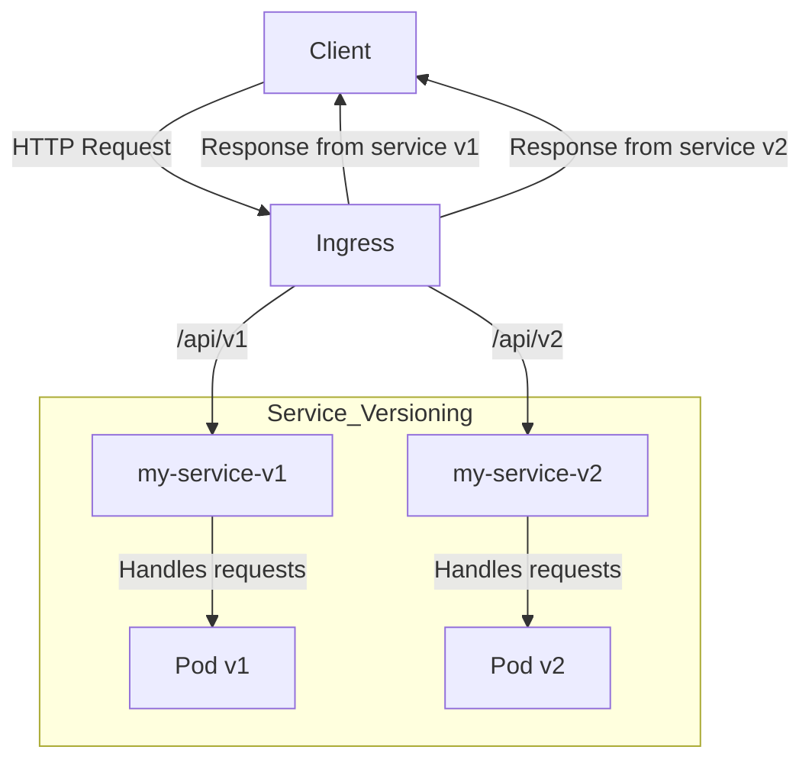

# Вводные условия

Необходимо обеспечить динамическое формирование API Сервисов (URL-ы REST-методов).

Более детально о внутреннем устройстве Сервиса, и вариантах компановки в [документе](service-structure.md).     


При формировании URL-ов необходимо учитывать:
- многослойность упаковки:
  - приложения (бизнес-логика) в виде контейнера;
  - доукомплектация Сервиса "контейнерами-обвесами" (логгеры, конверторы и адаптеры, валидаторы, хендлеры ошибок, 
    аутентификация/авторизация и прочее)
  - весь компонентный состав Сервиса (контейнеры) упаковывется в Pod;
  - группировка Pod, логически связанная упаковывается в Service;
  - как вариант:
    - Service упаковывается в Deployment;
    - Deployment упаковывается в StatefulSet;
    - StatefulSet упаковывается в DaemonSet;
    - DaemonSet упаковывается в StatefulSet;
    - StatefulSet упаковывается в Deployment;
    - Deployment упаковывается в Service;

- для управления доступами: 
  - Service Account для доступа к Pod;
  - ConfigMap для хранения переменных окружения;
  - Secret для хранения чувствительных данных;
  - StorageClass для хранения данных;
  - PersistentVolumeClaim для доступа к данным;
  - ServiceAccount для доступа к Secret;
  - ServiceAccount для доступа к ConfigMap;
  - ServiceAccount для доступа к PersistentVolumeClaim;
  - ServiceAccount для доступа к StorageClass;

# Роутинг
 
Пример маршрута, основанного на URL-ах (доступные составляющие маршрута):
  ```
    - /api/v1/namespaces/<namespace>/pods/<pod>/<container>/<command>
    - /api/v1/namespaces/<namespace>/pods/<pod>/<container>/<command>/<args>
   ```
В динамическом формировании URL-ов необходимо учитывать:
  - услуги (методы), которые предоставляет контейнер с бизнес-логикой - **_мажорная версия Сервиса_**:
    - ```/<container>/<command>```
    - ```/<container>/<command>/<args>```
    - ```/<command>```
    - ```/<command>/<args>```
  - версия Сервиса, в смысле компоновка контейнерами как Pod - **_минорная версия Сервиса_**:
    - ```/v1/<container>/<command>```
    - ```/v1/<command>```
  - версия Сервиса как группы Pod, а не группы Container - **__**:
    - ```namespaces/<namespace>/pods/<pod>```

  - Предположения и допущения:
    - возможно, ```/pods/<pod>``` заменяется на объект Service Кубернетес
    - возможно, параметры URL должны маппиться на части версии как-то иначе
    - URL API при необходимости возможно компоновать любыми способами (в примерах выше, каждый блок в URL 
      представляется новым уровнем абстракции, и несёт функцию инкапсуляции внутреннего устройства сетевого 
      связывания компонент)

Для управления маршрутизацией трафика и составления URL API с версионированием без изменения кода сервисов, 
    контейнеров и REST-контроллеров можно использовать такие инструменты, как **Ingress** и **Service** в Kubernetes.

### Архитектура

1. **Ingress**: Это объект Kubernetes, который управляет доступом к сервисам в кластере через HTTP и HTTPS. 
    Ingress позволяет определять правила маршрутизации трафика на основе URL и хостов. ~~В документации Ingress 
    считается устаревшим, и заменён на API Gateway - требуется уточнить!~~

2. **Service**: Объект Service в Kubernetes обеспечивает доступ к Pod'ам, предоставляя единый IP-адрес и DNS-имя 
для доступа к группе Pod'ов. Инкапсулирует end-point-ы Pod за end-point-ами service.

### Пример конфигураций Kubernetes

#### 1. Конфигурация Service
Примеры, приведённые в настоящем разделе необходимо встроить/добавить к имеющимся конфигурациям Кубернетес.

Предположим, у вас есть два сервиса: `my-service-v1` и `my-service-v2`, каждый из которых имеет свои Pod'ы.
```yaml
apiVersion: v1
kind: Service
metadata:
  name: my-service-v1
spec:
  selector:
    app: my-service
    version: v1
  ports:
    - protocol: TCP
      port: 80
      targetPort: 8080
---
apiVersion: v1
kind: Service
metadata:
  name: my-service-v2
spec:
  selector:
    app: my-service
    version: v2
  ports:
    - protocol: TCP
      port: 80
      targetPort: 8080
```

#### 2. Конфигурация Ingress
Аналогично с предыдущим примером, необходимо расширить имеющуюся конфигурацию Кубернетес, текущим конфигом.

Теперь создадим объект Ingress, который будет маршрутизировать запросы к соответствующим сервисам на основе URL.
```yaml
apiVersion: networking.k8s.io/v1
kind: Ingress
metadata:
  name: my-service-ingress
spec:
  rules:
    - host: myapi.example.com
      http:
        paths:
          - path: /api/v1
            pathType: Prefix
            backend:
              service:
                name: my-service-v1
                port:
                  number: 80
          - path: /api/v2
            pathType: Prefix
            backend:
              service:
                name: my-service-v2
                port:
                  number: 80
```

### Пояснения к примерам

1. **Service**:
  - Каждый сервис (`my-service-v1` и `my-service-v2`) имеет свой собственный объект Service, 
      который выбирает Pod'ы на основе меток (`app: my-service` и `version: v1/v2`). 
  - Это позволяет Kubernetes направлять трафик на нужные версии сервисов.

2. **Ingress**:
  - Объект Ingress управляет маршрутизацией трафика на основе правил, определенных в конфигурации. 
    В данном случае, если запрос приходит на `myapi.example.com/api/v1`, он будет направлен на `my-service-v1`, 
       а для `myapi.example.com/api/v2` — на `my-service-v2`.
  - Это позволяет добавлять новые версии API без изменения кода сервисов и контроллеров, 
       просто добавляя новые правила в Ingress.

3. **Версионирование API**:
  - Версионирование API достигается путем использования различных URL-путей (`/api/v1` и `/api/v2`). 
    Это позволяет клиентам обращаться к нужной версии API, не беспокоясь о том, как реализованы сервисы внутри 
    кластера.

### Заключение

Использование объектов Service и Ingress (API Gateway) в Kubernetes позволяет управлять маршрутизацией трафика и 
версионированием API без изменения кода сервисов. Это обеспечивает гибкость и масштабируемость архитектуры, 
позволяя легко добавлять новые версии сервисов и управлять ими.

Для создания схемы связности сервисов и отображения, откуда берется каждая часть URL, приведена диаграмма, 
которая иллюстрирует связь между сервисами и Ingress, а также показывает, как формируется URL.

### Mermaid Диаграмма



### Пояснения к диаграмме

1. **Client**: Клиент отправляет HTTP-запросы на определенный хост (например, `myapi.example.com`).

2. **Ingress**:
  - Ingress принимает запросы и маршрутизирует их на основе определенных правил. В данном случае, он проверяет, какой путь был указан в запросе (`/api/v1` или `/api/v2`).
  - В зависимости от пути, Ingress направляет запрос на соответствующий сервис.

3. **Сервисы**:
  - `my-service-v1` и `my-service-v2` — это сервисы, которые обрабатывают запросы. Они связаны с Pod'ами, которые фактически выполняют бизнес-логику.
  - Каждый сервис обрабатывает запросы и возвращает ответы клиенту через Ingress.

4. **Части URL**:
  - **Хост**: `myapi.example.com` — это основной адрес, на который клиент отправляет запросы.
  - **Путь**: `/api/v1` или `/api/v2` — это часть URL, которая определяет, к какой версии сервиса обращается клиент. Эти пути определены в конфигурации Ingress и используются для маршрутизации запросов.

### Заключение

Эта диаграмма и объяснения показывают, как связаны клиент, Ingress и сервисы, а также как формируется URL для доступа к различным версиям API. Использование Ingress позволяет легко управлять маршрутизацией и версионированием, не внося изменения в код самих сервисов.
